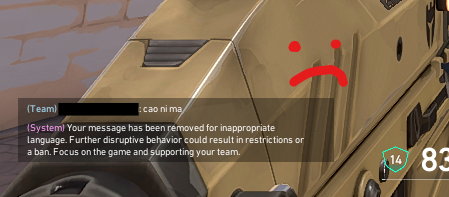
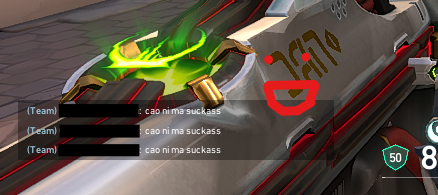

# valfilter

<br/>
<div align="center">
  <a href="https://github.com/JasonJasu/valfilter">
    
  </a>
  <a href="https://github.com/JasonJasu/valfilter">
    
  </a>
</div>
<br/>
obfuscation text real. you can swear easily filterless in valorant now

been personally using it for a while. works 90% of all time (better than nothing)


(use it at your own risk)

## Download

<a href=https://github.com/JasonJasu/valfilter/releases>https://github.com/JasonJasu/valfilter/releases></a>

## Compile it yourself?

Already made a makefile. Just run this on the terminal

```bash
git clone https://github.com/JasonJasu/valfilter.git
cd valfilter

make #to compile the exe
./valfilter #then run
```

